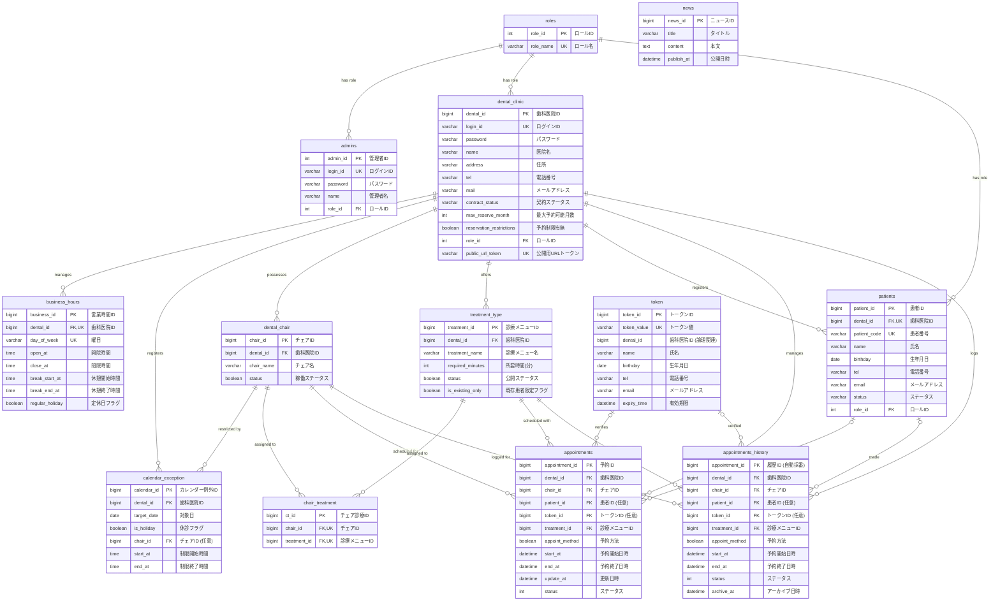

# TapDent Database ER Diagram (ER図)

TapDent のエンティティ定義から作成したデータベースのER図および詳細設計情報です。

---

## 1. ER図 (Entity Relationship Diagram)

---

## 2. テーブル定義詳細

### 2.1. `roles` (ロール定義)
システム全体の権限を管理するマスターテーブルです。

| カラム物理名 | 型・制約 | 説明 |
| :--- | :--- | :--- |
| `role_id` | `INT AUTO_INCREMENT` **[PK]** | ロールID |
| `role_name` | `VARCHAR(10) UNIQUE NOT NULL` | 権限名 (`ROLE_PATIENT`, `ROLE_CLINIC`, `ROLE_ADMIN`) |

### 2.2. `admins` (管理者情報)
マスタシステムを管理する管理者情報です。

| カラム物理名 | 型・制約 | 説明 |
| :--- | :--- | :--- |
| `admin_id` | `INT AUTO_INCREMENT` **[PK]** | 管理者ID |
| `login_id` | `VARCHAR(50) UNIQUE NOT NULL` | ログイン用ID |
| `password` | `VARCHAR(255) NOT NULL` | ハッシュ化されたパスワード |
| `name` | `VARCHAR(20) NOT NULL` | 管理者表示名 |
| `role_id` | `INT NOT NULL` **[FK -> roles.role_id]** | ロールID |

### 2.3. `dental_clinic` (歯科医院情報)
サービスを利用する歯科医院の情報です。

| カラム物理名 | 型・制約 | 説明 |
| :--- | :--- | :--- |
| `dental_id` | `BIGINT AUTO_INCREMENT` **[PK]** | 歯科医院ID |
| `login_id` | `VARCHAR(50) UNIQUE NOT NULL` | ログイン用ID |
| `password` | `VARCHAR(255) NOT NULL` | ハッシュ化されたパスワード |
| `name` | `VARCHAR(50) NOT NULL` | 歯科医院名 |
| `address` | `VARCHAR(255)` | 住所 |
| `tel` | `VARCHAR(20)` | 電話番号 |
| `mail` | `VARCHAR(255)` | メールアドレス |
| `contract_status` | `VARCHAR(10) NOT NULL` | 契約ステータス (`ACTIVE`, `INACTIVE` 等) |
| `max_reserve_month` | `INT` | 最大予約可能月数 |
| `reservation_restrictions` | `BOOLEAN NOT NULL DEFAULT FALSE` | 予約制限有無 |
| `role_id` | `INT NOT NULL` **[FK -> roles.role_id]** | ロールID |
| `public_url_token` | `VARCHAR(255) UNIQUE NOT NULL` | 公開用URL用のユニークトークン |

### 2.4. `business_hours` (営業時間設定)
各歯科医院の曜日ごとの営業時間設定です。

> [!NOTE]
> `dental_id` と `day_of_week` の組み合わせにユニーク制約（複合ユニーク）が設定されています。

| カラム物理名 | 型・制約 | 説明 |
| :--- | :--- | :--- |
| `business_id` | `BIGINT AUTO_INCREMENT` **[PK]** | 営業時間設定ID |
| `dental_id` | `BIGINT NOT NULL` **[FK -> dental_clinic.dental_id]** | 歯科医院ID |
| `day_of_week` | `VARCHAR(255) NOT NULL` | 曜日 (Java標準の `DayOfWeek` 文字列) |
| `open_at` | `TIME NOT NULL` | 開院時刻 |
| `close_at` | `TIME NOT NULL` | 閉院時刻 |
| `break_start_at` | `TIME` | 休憩開始時刻 |
| `break_end_at` | `TIME` | 休憩終了時刻 |
| `regular_holiday` | `BOOLEAN NOT NULL DEFAULT FALSE` | 定休日フラグ |

### 2.5. `dental_chair` (診療用チェア情報)
各歯科医院が持つ診療用チェア（ユニット）情報です。

| カラム物理名 | 型・制約 | 説明 |
| :--- | :--- | :--- |
| `chair_id` | `BIGINT AUTO_INCREMENT` **[PK]** | チェアID |
| `dental_id` | `BIGINT NOT NULL` **[FK -> dental_clinic.dental_id]** | 歯科医院ID |
| `chair_name` | `VARCHAR(20) NOT NULL` | チェア表示名 |
| `status` | `BOOLEAN NOT NULL DEFAULT TRUE` | 稼働ステータス (TRUE:稼働、FALSE:非稼働) |

### 2.6. `treatment_type` (診療メニュー)
各歯科医院が提供する診療メニュー（虫歯治療、クリーニング等）です。

| カラム物理名 | 型・制約 | 説明 |
| :--- | :--- | :--- |
| `treatment_id` | `BIGINT AUTO_INCREMENT` **[PK]** | 診療メニューID |
| `dental_id` | `BIGINT NOT NULL` **[FK -> dental_clinic.dental_id]** | 歯科医院ID |
| `treatment_name` | `VARCHAR(20) NOT NULL` | メニュー名 |
| `required_minutes` | `INT NOT NULL` | 所要時間 (分単位) |
| `status` | `BOOLEAN NOT NULL DEFAULT TRUE` | 公開ステータス (TRUE:公開、FALSE:非公開) |
| `is_existing_only` | `BOOLEAN NOT NULL DEFAULT TRUE` | 制限対象 (TRUE:全員、FALSE:既存患者限定) |

### 2.7. `chair_treatment` (チェア別対応メニュー)
チェアがどの診療メニューに対応しているかを紐付ける中間テーブルです。

> [!NOTE]
> `chair_id` と `treatment_id` の組み合わせにユニーク制約（複合ユニーク）が設定されています。

| カラム物理名 | 型・制約 | 説明 |
| :--- | :--- | :--- |
| `ct_id` | `BIGINT AUTO_INCREMENT` **[PK]** | チェア別対応メニューID |
| `chair_id` | `BIGINT NOT NULL` **[FK -> dental_chair.chair_id]** | チェアID |
| `treatment_id` | `BIGINT NOT NULL` **[FK -> treatment_type.treatment_id]** | 診療メニューID |

### 2.8. `calendar_exception` (カレンダー例外設定)
祝日や特定日の休診・チェア制限情報を管理します。

| カラム物理名 | 型・制約 | 説明 |
| :--- | :--- | :--- |
| `calendar_id` | `BIGINT AUTO_INCREMENT` **[PK]** | 例外設定ID |
| `dental_id` | `BIGINT NOT NULL` **[FK -> dental_clinic.dental_id]** | 歯科医院ID |
| `target_date` | `DATE NOT NULL` | 設定対象日 |
| `is_holiday` | `BOOLEAN NOT NULL DEFAULT FALSE` | 終日休診フラグ |
| `chair_id` | `BIGINT` **[FK -> dental_chair.chair_id] (Null許容)** | 特定チェア制限時のチェアID |
| `start_at` | `TIME` | 制限開始時間 |
| `end_at` | `TIME` | 制限終了時間 |

### 2.9. `patients` (患者アカウント情報)
登録されている患者（既存患者）の情報です。

> [!NOTE]
> `dental_id` と `patient_code` の組み合わせにユニーク制約（複合ユニーク）が設定されています。

| カラム物理名 | 型・制約 | 説明 |
| :--- | :--- | :--- |
| `patient_id` | `BIGINT AUTO_INCREMENT` **[PK]** | 患者ID |
| `dental_id` | `BIGINT NOT NULL` **[FK -> dental_clinic.dental_id]** | 所属歯科医院ID |
| `patient_code` | `VARCHAR(20) NOT NULL` | 診察券番号・患者コード |
| `name` | `VARCHAR(50) NOT NULL` | 氏名 |
| `birthday` | `DATE NOT NULL` | 生年月日 |
| `tel` | `VARCHAR(20)` | 電話番号 |
| `email` | `VARCHAR(255)` | メールアドレス |
| `status` | `VARCHAR(10) NOT NULL` | アカウントステータス |
| `role_id` | `INT NOT NULL` **[FK -> roles.role_id]** | ロールID |

### 2.10. `token` (仮患者予約用ワンタイムトークン)
未登録の新規患者が一時的に予約を行うためのトークン情報です。

| カラム物理名 | 型・制約 | 説明 |
| :--- | :--- | :--- |
| `token_id` | `BIGINT AUTO_INCREMENT` **[PK]** | トークンID |
| `token_value` | `VARCHAR(255) UNIQUE NOT NULL` | トークンハッシュ値 |
| `dental_id` | `BIGINT NOT NULL` | 対象の歯科医院ID (論理キー) |
| `name` | `VARCHAR(20) NOT NULL` | 氏名 |
| `birthday` | `DATE NOT NULL` | 生年月日 |
| `tel` | `VARCHAR(20) NOT NULL` | 電話番号 |
| `email` | `VARCHAR(255) NOT NULL` | メールアドレス |
| `expiry_time` | `DATETIME NOT NULL` | 有効期限 |

### 2.11. `appointments` (予約情報)
現在スケジュールされている予約のデータです。

| カラム物理名 | 型・制約 | 説明 |
| :--- | :--- | :--- |
| `appointment_id` | `BIGINT AUTO_INCREMENT` **[PK]** | 予約ID |
| `dental_id` | `BIGINT NOT NULL` **[FK -> dental_clinic.dental_id]** | 歯科医院ID |
| `chair_id` | `BIGINT NOT NULL` **[FK -> dental_chair.chair_id]** | 使用するチェアID |
| `patient_id` | `BIGINT` **[FK -> patients.patient_id] (Null許容)** | 患者ID (本会員予約の場合) |
| `token_id` | `BIGINT` **[FK -> token.token_id] (Null許容)** | 仮会員トークンID (新規予約の場合) |
| `treatment_id` | `BIGINT NOT NULL` **[FK -> treatment_type.treatment_id]** | 診療メニューID |
| `appoint_method` | `BOOLEAN NOT NULL` | 予約方法 (TRUE:オンライン, FALSE:オフライン) |
| `start_at` | `DATETIME NOT NULL` | 予約開始時間 |
| `end_at` | `DATETIME NOT NULL` | 予約終了時間 |
| `update_at` | `DATETIME NOT NULL` | 更新日時 |
| `status` | `INT NOT NULL` | 予約ステータス (Enum Ordinal) |

### 2.12. `appointments_history` (予約履歴)
過去の予約やキャンセルされた予約のアーカイブです。

| カラム物理名 | 型・制約 | 説明 |
| :--- | :--- | :--- |
| `appointment_id` | `BIGINT AUTO_INCREMENT` **[PK]** | 履歴レコード固有のID |
| `dental_id` | `BIGINT NOT NULL` **[FK -> dental_clinic.dental_id]** | 歯科医院ID |
| `chair_id` | `BIGINT NOT NULL` **[FK -> dental_chair.chair_id]** | チェアID |
| `patient_id` | `BIGINT` **[FK -> patients.patient_id] (Null許容)** | 患者ID (本会員予約の場合) |
| `token_id` | `BIGINT` **[FK -> token.token_id] (Null許容)** | 仮会員トークンID (新規予約の場合) |
| `treatment_id` | `BIGINT NOT NULL` **[FK -> treatment_type.treatment_id]** | 診療メニューID |
| `appoint_method` | `BOOLEAN NOT NULL` | 予約方法 (TRUE:オンライン, FALSE:オフライン) |
| `start_at` | `DATETIME NOT NULL` | 予約開始時間 |
| `end_at` | `DATETIME NOT NULL` | 予約終了時間 |
| `status` | `INT NOT NULL` | 予約ステータス (Enum Ordinal) |
| `archive_at` | `DATETIME NOT NULL` | アーカイブ登録された日時 |

### 2.13. `news` (お知らせ情報)
各医院または全体の公開ニュース情報です。

| カラム物理名 | 型・制約 | 説明 |
| :--- | :--- | :--- |
| `news_id` | `BIGINT AUTO_INCREMENT` **[PK]** | ニュースID |
| `title` | `VARCHAR(20) NOT NULL` | お知らせタイトル |
| `content` | `TEXT NOT NULL` | お知らせ本文 |
| `publish_at` | `DATETIME NOT NULL` | 公開日時 |
